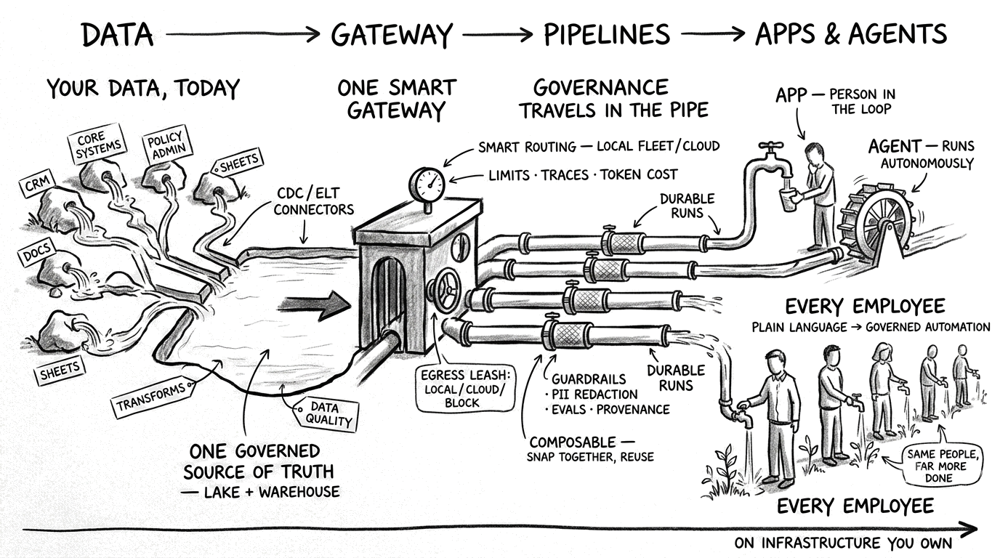
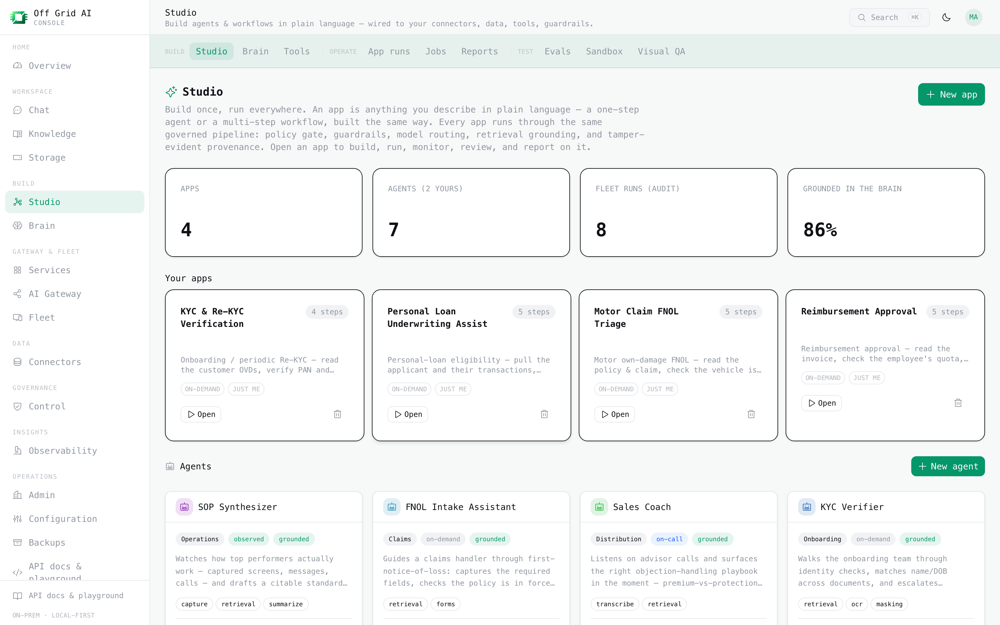
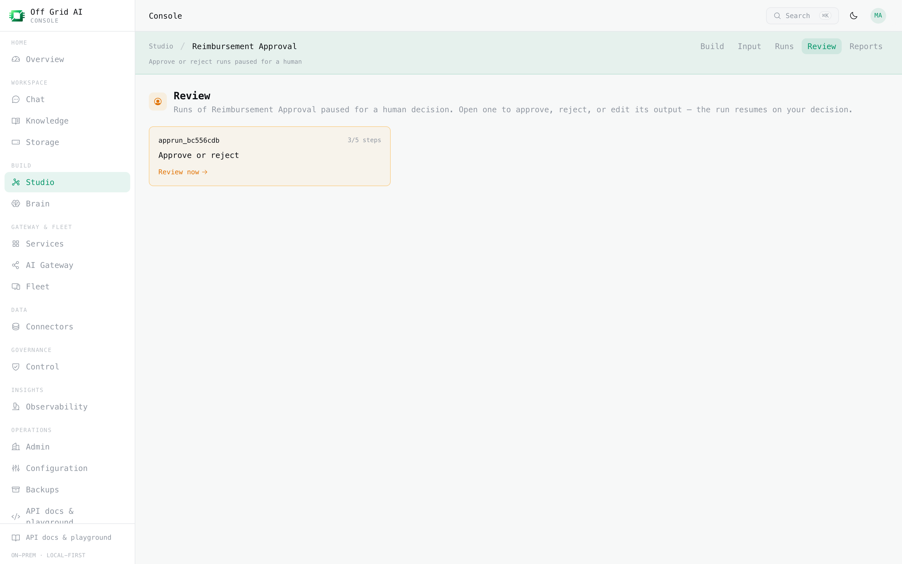
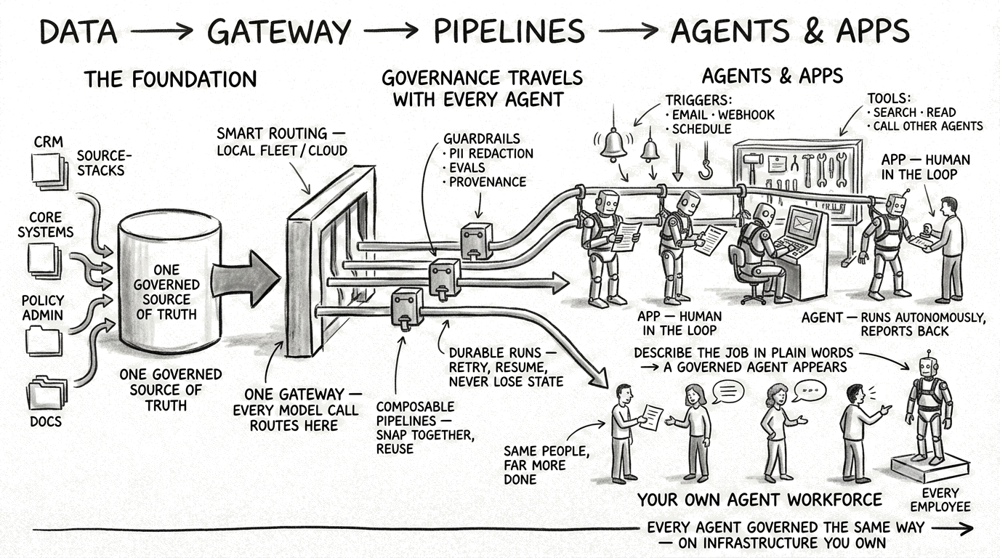
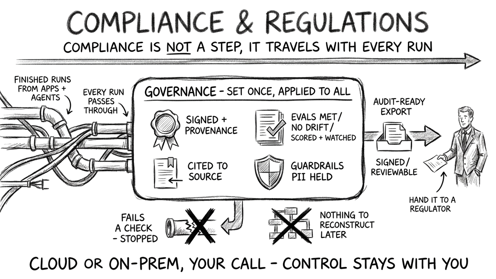

<div align="center">
  
  <h1>Off Grid AI Console</h1>
  <h3>AWS for AI. Make your enterprise intelligent, on one interface that just works.</h3>
  <p>Open source. Set your rules once. Everyone builds governed AI on top.</p>
  <p>
    <a href="https://github.com/off-grid-ai/console/actions/workflows/ci.yml"></a>
    
    
    
    
  </p>
</div>



Every piece you need to run AI in a company already exists. A gateway to the models. Evals. Guardrails.
PII masking. Data pipelines. Audit. Lineage. Knowledge bases. The problem was never the parts. It was
wiring them into one thing that works, and keeping every team inside the rules.

AWS meant you stopped assembling servers. Off Grid AI means you stop assembling AI infrastructure.
It is one interface where all of it is already set up and connected. You define your organization's
rules, policies, guardrails, and knowledge once. Everyone builds on top of them. It just works.

```bash
git clone https://github.com/off-grid-ai/console.git && cd console
npm install
cp .env.example .env.local        # fill in DATABASE_URL, AUTH_SECRET, AUTH_KEYCLOAK_*
make -C deploy up                 # the whole stack comes up, wired together
npm run db:push                   # create the schema
npm run dev                       # http://localhost:3000
```

That is the setup. It just works. Needs Docker and Node 20+. The full backing stack is one
`docker compose` bring-up, wired together, and every capability has a first-party default so you
only run the pieces you want. Run it on your own servers or in your cloud, your call.

---

## What it is

An open-source platform you run on your own servers that makes your enterprise intelligent.

It harnesses the data and context already inside your organization, and lets your people and their
agents put frontier models to work on it, to raise their productivity, output, and quality. Every
run is secure, reliable, compliant, and governed, without anyone wiring that up per app.

Non-technical people build the apps. They describe what they need in plain language and get back a
working, governed workflow, tested in a sandbox before it touches anything real.

## See it

One place to build. Real apps and agents a business team can stand up in plain language: KYC,
underwriting, claims triage, reimbursements.



Anything that needs a person pauses for one. The approver opens it, decides, and the run resumes and
finishes on its own.



**[See every feature, screen by screen →](features/README.md)** — the gateway, knowledge, the Studio, agent QA, signed provenance, data, regulatory report packs, and FinOps, each with a screenshot from the live console.

## Set once, use everywhere

This is the part that changes how an enterprise runs AI.

An administrator defines the organization's rules, policies, guardrails, observability, data
lineage, and knowledge bases one time. From then on, every employee and every agent inherits them
automatically. Nobody re-implements governance. Nobody works around it. Nobody ships an app your
risk team has not already blessed.

## How it flows

```
   data  ->  gateway  ->  pipelines  ->  agents / apps  ->  compliance & regulations
 (your        (one         (evals,        (built by         (audited, cited,
  systems)     governed     drift,         non-technical      signed, reversible,
               model door)  guardrails,    people in          regulator-ready)
                            PII, policy)   plain language)
```



Compliance is not a stage you bolt on at the end. It travels with every run: signed, cited, scored,
guardrails held, and stopped the moment a check fails. At any point you hand a regulator a complete,
reversible account.



- **Data.** It connects to the databases, warehouses, and identity you already run. You change
  nothing about your stack.
- **Gateway.** One governed door to every model. Local by default. Cloud routing is opt-in and masks
  sensitive fields before a byte leaves the box.
- **Pipelines.** Bind a model, evals, a golden set, policy, guardrails, and drift to a use case once.
  Everything built on top inherits all of it.
- **Agents and apps.** The people who know the work build the workflow, in plain language, in a
  sandbox.
- **Compliance.** Every run is audited, every answer cited, every output signed. Export it and hand
  it to a regulator.

## Why it matters

An enterprise reaches its full potential by amplifying its own moat: its data, its people, its
processes, its reach. Off Grid AI lets it do that through one governed interface, so putting AI to
work is a thing anyone in the org can do inside the rules, not a project that waits on a platform
team. Real change reaches people through the enterprises that serve them. This is how those
enterprises get intelligent.

## The governance is ours. The engines are swappable.

Two layers, and the distinction matters.

**The governance spine is Off Grid AI's own code, always on.** It is not borrowed from a library.
Every model call runs through it, and it is what a pipeline binds once and every app inherits.

Three kinds of check, each honest about its cost:

- **Deterministic, in-path, blocking, no meaningful latency.** Policy and the egress leash (each
  call resolves to local, cloud, or blocked per the data class), the regex PII floor, request-parameter
  checks, and model rules. A call that is not allowed off the box does not leave.
- **ML, in-path, blocking, latency-bearing.** The model-based guardrails (prompt-injection,
  toxicity, bias, ML PII detection) run on the request before the model answers. They screen and
  can block, and they do add latency, because they are real inference. Enable per pipeline.
- **LLM-as-judge, on the gateway model, out of band.** A gateway model judges each run for
  faithfulness to its cited sources and answer quality. Grounded runs must cite; the judge scores
  whether they did. It runs after the answer, so it adds no latency, and feeds the eval and
  observability layer.

Guardrails are tightening-only from the org default down.

On top of that: every run is signed, cited, and written to an append-only audit log; runs are scored
against a golden set and watched for drift; FinOps tracks per-key and per-user budgets and cost; and
controls map to ISO 42001, NIST AI RMF, and the EU AI Act with DPIA and regulator-ready exports.

None of that requires an external service. `npm run dev` has it on.

**The engines are the swappable backends.** For specific detection, decision, storage, and
observability steps, Off Grid AI ships a first-party default and lets you point one environment
variable at a best-in-class open-source engine. Same governance either way.

| Capability | Default, no setup | Swap in (one env var) | In the console |
|---|---|---|---|
| Model gateway | [Off Grid AI Desktop](https://github.com/off-grid-ai/off-grid-ai-desktop) in gateway mode, OpenAI-compatible, local fleet or cloud | — | Gateway |
| State + audit | [Postgres](https://www.postgresql.org) (append-only audit is always on) | — | everywhere |
| Identity / SSO | [Keycloak](https://www.keycloak.org) (OIDC) | — | Access |
| Vectors / RAG | [LanceDB](https://lancedb.com) (embedded) | [Qdrant](https://qdrant.tech) or [pgvector](https://github.com/pgvector/pgvector) | Brain, Knowledge |
| Policy decisions | first-party ABAC | [Open Policy Agent](https://www.openpolicyagent.org) | Control |
| Guardrails (screen prompts + responses) | regex floor (PII detect + mask) | [Presidio](https://microsoft.github.io/presidio/) (ML PII) or an external guard over HTTP ([Lakera](https://www.lakera.ai), [Aporia](https://www.aporia.com), self-hosted) | Control |
| Evals + drift | first-party golden set + PSI drift | [Ragas](https://docs.ragas.io), [Evidently](https://www.evidentlyai.com) (`qa` profile) | Observability |
| Cost + budgets (FinOps) | first-party pricing + budget enforcement | — | Insights |
| Compliance mapping | first-party control catalog (ISO 42001 / NIST AI RMF / EU AI Act) + exports | — | Governance |
| Response cache | in-process | [Redis](https://redis.io) | — |
| Feature flags | Postgres | [Unleash](https://www.getunleash.io) (reads) | Admin |
| Secrets | env vars | [OpenBao](https://openbao.org) (KV) | Control |
| Audit search / SIEM | Postgres audit | [OpenSearch](https://opensearch.org) (full-text + dashboards, read back into the UI) | Control |
| LLM traces + scores | first-party run trace | [Langfuse](https://langfuse.com) (span waterfall read back into the UI) | Observability |
| Lineage | audit-reconstructed | [Marquez](https://marquezproject.ai) (OpenLineage graph read back into the UI) | Lineage |
| Data plane | connect a source, sync it, warehouse it | [Airbyte](https://airbyte.com) sync, [Kestra](https://kestra.io) orchestration, [ClickHouse](https://clickhouse.com) warehouse | Data |

**Working, with a caveat we will not hide**

- **PII masking** is regex string-replace today. Presidio's ML detection runs in-path; its ML redaction (`/anonymize`) is next, not yet wired.
- **External guardrail engines** (Lakera, Aporia, Prompt-Security) plug into a generic HTTP seam that ships and works today. A named-vendor mapping is one config plus at most one field-map, documented, not a pre-built branded integration per vendor.
- **Durable runs.** Temporal execution visibility is wired (you can see workflow state). Durable execution itself is opt-in (`OFFGRID_QUEUE_ENABLED=1`) and still being hardened. Runs are synchronous by default.
- **BI dashboards.** [Superset](https://superset.apache.org) embeds on Insights after a one-time `superset init`.
- **Device fleet.** Host inventory, live osquery, software/CVE, and policies work today via [Fleet](https://fleetdm.com)'s open-source core (agent-enrolled). Full **MDM control (lock/wipe/config profiles, Apple APNs) is coming soon**, and some advanced MDM/RBAC is Fleet Premium (separately licensed).
- **Deeper data-plane CRUD** (source or destination creation, dbt-orchestrated transforms) is partial. Connector sync and job read-back work now.

**On the roadmap (not built yet)**

Agent frameworks ([CrewAI](https://www.crewai.com) / [Agno](https://www.agno.com)), runtime threat detection (Falco), cloud microVM sandboxing (E2B), full durable execution, the Prove-It test-recording module, the cross-device capture + "Soul" intelligence layer, managed hosting, and the `@offgrid/sdk`. Tracked in [`docs/ROADMAP.md`](docs/ROADMAP.md).

## Run it

```bash
npm install
cp .env.example .env.local        # DATABASE_URL, AUTH_SECRET, AUTH_KEYCLOAK_* are the essentials
make -C deploy up                 # full stack; or `make -C deploy data` for just Postgres + storage
npm run db:push                   # create the schema
npm run dev                       # http://localhost:3000
npm run build                     # production build
npm test                          # real tests, against a real database
```

`make -C deploy` lists every stack target (data, secrets, identity, agents, and more) so you can
bring up only what you need. Full self-hosting and configuration are documented in the app at `/docs`.

## When to use it

A data-sensitive or regulated enterprise that wants AI inside real operational workflows (claims,
underwriting, reconciliation, reporting), cannot send that data to a hosted AI, needs every step
auditable, and wants business teams to build these themselves. BFSI is the sharp case. It is not for
a public consumer chatbot or a throwaway prototype.

## License

Open source under AGPL-3.0. The entire platform. Nothing held back, nothing gated.

---

*Built by [Wednesday](https://wednesday.is). Developer guide: [`CLAUDE.md`](CLAUDE.md). Roadmap: [`docs/ROADMAP.md`](docs/ROADMAP.md).*
