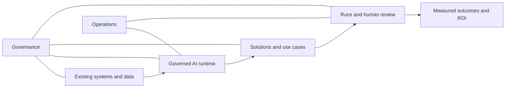

# Off Grid AI information architecture

**Designer brief · 17 July 2026 · Draft for product design**

## 1. What this IA is trying to achieve

Off Grid AI connects to an enterprise's existing systems and data, lets teams build governed AI
solutions, runs those solutions reliably, and proves their business impact.

The navigation should express that product story—not the names of infrastructure products or the
history of how the console was built.

The proposed global navigation has eight sections:

1. Home
2. Work
3. Solutions
4. Data
5. AI Runtime
6. Governance
7. Insights
8. Operations

These sections are intended to be true siblings. Each represents a distinct user concern and owns a
different class of product object.

## 2. Core design principles

### One canonical home per entity

Every entity has exactly one place where it is created, edited, deleted and managed. It may appear
elsewhere as a summary, filtered view or link, but those appearances must use the same underlying
record.

Examples:

- A run is managed in **Operations → Runs**. An app page may show that app's runs, but it links to the
  same run detail rather than creating a second run model.
- A policy is managed in **Governance → Policies**. A solution or pipeline may assign a policy and
  show inherited policy state, but it does not own another policy record.
- An outcome is measured in **Insights → Outcomes**. Home and app detail may summarize it.

### Navigate by product capability, not vendor

Open-source products and infrastructure engines are implementation details. Users should see
capabilities such as Sources, Flows, Policies, Services and Platform health—not Airbyte, Kestra, OPA,
Redpanda or Jaeger as primary navigation items.

The underlying engine may appear on an advanced detail screen as implementation metadata.

### Collections lead to real detail pages

Every meaningful collection follows a list-to-detail model:

- `/solutions/apps` → `/solutions/apps/[appId]`
- `/operations/runs` → `/operations/runs/[runId]`
- `/operations/nodes` → `/operations/nodes/[nodeId]`
- `/operations/services` → `/operations/services/[serviceId]`

Detail pages are shareable URLs and browser Back must return to the previous collection, filter or
tab. A modal can support quick creation or editing, but it should not replace a detail page for an
entity with history, sub-resources or actions.

### Infrastructure instances are dynamic data

Physical machines, clusters and service instances must never be hard-coded into navigation. The
fleet can change without requiring an IA or route change.

- Node collection: `/operations/nodes`
- Node detail: `/operations/nodes/[nodeId]`
- Cluster collection: `/operations/clusters`
- Cluster detail: `/operations/clusters/[clusterId]`
- Service collection: `/operations/services`
- Service detail: `/operations/services/[serviceId]`
- Service instance: `/operations/services/[serviceId]/instances/[instanceId]`

The current eight-node fleet and current Qwythos membership are records supplied by the registry,
not navigation children.

### Design for two levels of technical confidence

Non-technical users should be able to begin with **Work** and **Solutions**. Platform operators should
be able to reach **AI Runtime**, **Governance** and **Operations** without those concepts overwhelming
the everyday experience.

## 3. Information architecture overview

| Section | Primary question | Canonical ownership |
|---|---|---|
| **Home** | What matters right now? | No entities; summaries and shortcuts only |
| **Work** | What am I working on? | Human work objects |
| **Solutions** | What business capability are we building and operating? | Apps/use cases, reviews, tools and quality definitions |
| **Data** | Which enterprise systems and knowledge can solutions use? | Sources, domains, flows, warehouse, catalog, knowledge and lineage |
| **AI Runtime** | Which AI capabilities are available, and how are requests governed? | Models, gateways, model-access pipelines, API clients and budgets |
| **Governance** | Who can do what, with which data, under which controls? | Policies, access, guardrails, secrets and evidence |
| **Insights** | Is AI effective, adopted and economically justified? | Measured outcomes, behavior, usage, quality and cost |
| **Operations** | Is the execution platform running correctly? | Runs, nodes, clusters, services, health, edge, configuration and recovery |

## 4. Detailed hierarchy

### Home

**Purpose:** Answer what needs attention, what value is being created and where the user should go
next.

Home owns no canonical entities. Every element should link to the entity's actual owner.

- **Attention queue** — risks, failed runs, pending reviews, policy exceptions and service incidents.
- **Outcome snapshot** — ROI, throughput, quality, cost and newly unlocked capability.
- **Active work** — recent apps, projects, chats and runs.
- **Platform snapshot** — service health, node health, queue health and backup posture.
- **Quick actions** — run an app, create a solution, connect a system or review an exception.

Design direction: prioritize business outcomes and required action above infrastructure statistics.
Home should feel like a useful briefing, not a second dashboard for every module.

### Work

**Purpose:** Provide a simple daily surface for people using Off Grid AI without requiring platform
knowledge.

- **Chat** — conversations, messages, project context, knowledge references and artifacts.
- **Projects** — instructions, members, chats, apps, knowledge bindings and activity.
- **Prompts** — templates, versions, partials and assignments.
- **Artifacts** — generated outputs, versions, provenance and sharing.
- **Files** — folders, files, visibility and sharing.

Work owns human work objects. Enterprise Knowledge remains canonically owned by Data; Work consumes
and references it.

### Solutions

**Purpose:** Build and operate high-value BFSI use cases that improve revenue, effectiveness,
efficiency or organizational capability.

- **Apps / use cases** — overview and outcome, build, inputs, schedule, reviews, reports and linked
  runs. Agents are represented as an app kind, not as a parallel product universe.
- **Builder** — guided creation, steps, tools, data bindings, policies and testing.
- **Reviews** — tasks, approvals, exceptions, assignments and decision history.
- **Tools** — HTTP tools, MCP tools, built-in primitives and app assignments.
- **Quality definitions** — evaluators, golden sets, quality gates and app assignments.
- **Solution templates** *(proposed)* — reusable BFSI patterns with required systems, an outcome
  model, deployment recipe and evidence.

The App/Solution is the product center. Its detail should make the end-to-end lifecycle legible:
build → provide inputs → run → review → measure outcome.

### Data

**Purpose:** Connect existing enterprise systems and turn their data into governed, usable context
for solutions.

- **Sources** — systems, connectors, credentials, resources and connection tests.
- **Domains** — business terms, owners, source mappings, policies and SLAs.
- **Flows** — replicated syncs, orchestrated jobs, mappings, schedules and executions.
- **Warehouse** — tables, columns, queries, profiles and freshness.
- **Catalog** — datasets, owners, classification, freshness and impact.
- **Knowledge** — collections, documents, indexes, permissions and app bindings.
- **Lineage** — edges, events, source-to-answer trace and impact analysis.

Use **Flows** for enterprise data movement. Reserve **Pipelines** for governed model-access contracts
under AI Runtime.

### AI Runtime

**Purpose:** Control which AI capabilities are available and how governed requests reach them.

- **Models** — logical models, capabilities, versions, availability and deployment assignments.
- **Gateways** — model endpoints, providers, health, egress class and routing availability.
- **Pipelines** — consumers, routing contract, data ceiling, policy assignment, guardrail assignment
  and quality gates.
- **API & budgets** — API keys, clients, budgets, rate limits and usage links.

AI Runtime owns logical models and access contracts. Physical machines and process instances belong
to Operations.

### Governance

**Purpose:** Define, enforce and prove who can do what, with which data, under which controls.

- **Posture** — overall control status, exceptions, risk and emergency actions.
- **Policies** — rules, versions, decisions, assignments and decision history.
- **Access** — users, roles, sessions, MFA and service accounts.
- **Teams** — teams, members and delegated access.
- **Guardrails** — rules, recognizers, masking, thresholds and tests.
- **Secrets** — secrets, mounts, leases, seal state and rotation.
- **Evidence** — audit events, security events, provenance and evidence exports.
- **Trust & regulatory** — frameworks, controls, attestations, DPIAs and regulatory reports.

Global rules live here. Solutions and pipelines should show inherited controls and scoped
assignments, with a clear link back to their canonical Governance record.

### Insights

**Purpose:** Show whether AI and solutions are effective, reliable, adopted and economically
justified.

- **Outcomes** — business KPIs, ROI, throughput, effectiveness and capability unlocked.
- **AI behavior** — traces, latency, errors, routing and response behavior.
- **Usage** — requests, tokens, users, apps and adoption.
- **Quality results** — evaluation runs, drift, scorecards, visual QA and quality trends.
- **Cost** — spend, attribution, unit cost, budget consumption and savings.

Insights owns measured results, not configuration or operational actions. Separate authoring quality
definitions in Solutions from observed quality results here.

### Operations

**Purpose:** Run and maintain the execution plane, physical fleet, platform services and recovery
controls.

- **Runs** — all runs, run detail, steps, inputs and outputs, events, retry and cancellation.
- **Physical nodes** — registry-driven inventory, health, capacity, roles, placements and lifecycle
  actions.
- **Compute clusters** — derived cluster inventory, head/member relationships, interconnect health
  and lifecycle actions.
- **Services** — deployment-registry inventory, service instances, health, dependencies, placement,
  configuration references and lifecycle actions.
- **Platform health** — metrics, logs, traces, alerts and queue health.
- **Edge** — routes, tunnel, WAF, rate limits and blocked traffic.
- **Managed devices** *(proposed)* — enrollment, inventory, commands, policies, software and live
  query.
- **Configuration** — adapters, feature flags, authentication and environment references.
- **Backups** — jobs, schedules, restore, retention and replication.
- **Admin** — tenants, organization settings and platform administration.

Operations answers: “Is it running, where is it running, and what can I do about it?” Capability
pages answer: “How do I manage the business resource?”

## 5. Object types and visual treatment

The IA includes different kinds of navigation objects. Their presentation should communicate the
difference.

| Type | Meaning | Examples | Design implication |
|---|---|---|---|
| **Entity** | A durable object with lifecycle and management | App, source, policy, run, service | Collection → detail; full actions and history |
| **Derived entity** | A computed grouping of canonical records | Compute cluster | Show source relationships; do not duplicate records |
| **Lens** | A filtered or summarized view of canonical entities | Attention queue, posture | Always deep-link to the owner |
| **Result** | Measured evidence produced by activity | Outcomes, quality results, health | Lead with trends, attribution and drill-down |
| **Action** | A task or guided flow, not a stored object | Builder, quick actions | Focused entry point; return to the created entity |
| **Proposed** | Direction that still needs product confirmation | Solution templates, managed devices | Visually mark as future/unconfirmed; do not imply availability |

## 6. Critical cross-section relationships

These relationships should be designed as contextual references rather than duplicate screens.

| Context | Show here | Canonical owner |
|---|---|---|
| App detail | Scoped runs and outcome summary | Runs: Operations; outcomes: Insights |
| App or pipeline detail | Assigned policy and guardrails | Governance |
| Work/Chat | Referenced knowledge | Data → Knowledge |
| Home | Outcome, risk and health summaries | Insights, Governance and Operations |
| Pipeline detail | Routing, access contract and assignments | AI Runtime |
| Data flow detail | Movement executions and lineage | Data; execution links may open Operations → Runs |
| Service detail | Placement on nodes and dependencies | Operations → Nodes/Services |
| Insights | Engine metadata and source links | Configuration stays in Runtime/Governance/Operations |

## 7. Primary user journeys to prototype

### Connect a system and create value

1. Add or select a Source.
2. Test access and select resources.
3. Map the source into a Domain.
4. Create a Flow into governed data/knowledge.
5. Bind that data to an App/use case.
6. Run and review the solution.
7. See throughput, quality, cost and ROI in Outcomes.

### Build a governed solution

1. Start from Apps or a proposed Solution template.
2. Define inputs, steps, tools and data bindings.
3. Assign the model-access Pipeline.
4. Confirm inherited policy, guardrails and quality gates.
5. Test, publish and schedule.
6. Review Runs and human-review tasks.

### Investigate an operational incident

1. Enter from Home's attention queue or Operations → Platform health.
2. Inspect the affected service and service instance.
3. Follow dependencies and node placement.
4. Review logs, traces and relevant failed runs.
5. Perform an authorized lifecycle action.
6. Return to the incident and confirm recovery.

### Prove governance and impact

1. Open Governance → Evidence for audit/security records.
2. Trace a decision to its policy, user, app, data and run.
3. Open Insights → Outcomes for business evidence.
4. Export the appropriate governance or outcome report without duplicating the underlying records.

## 8. Navigation and interaction guidance

- Keep the eight global sections stable. Avoid a catch-all **More** section.
- Preserve the user's collection filters and view when they return from detail.
- Use breadcrumbs for deep entity context, especially Data, Governance and Operations.
- Use tabs only for stable sub-resources of the same entity; tabs must be reflected in the URL.
- Use contextual links for related entities owned elsewhere. Label them clearly—for example, “View
  policy,” “Open run” or “See outcome details.”
- Show inherited versus overridden governance state explicitly.
- Use honest empty and unavailable states. “No records,” “service unavailable” and “not configured”
  are different conditions.
- Surface the actual engine used for an operation when fallbacks are possible.
- Keep advanced infrastructure metadata secondary to the product capability.
- Design the console for wide desktop screens. Collections should use the available width, and detail
  pages should place related information and actions in responsive columns instead of one narrow
  vertical stack.

## 9. Language guidelines

Prefer user and domain language:

- **Apps / use cases**, not agent framework internals.
- **Flows** for enterprise data movement.
- **Pipelines** for governed AI/model access.
- **Physical nodes** for compute machines.
- **Managed devices** for employee endpoints; do not call both concepts “fleet.”
- **Services** for deployable platform capabilities.
- **Outcomes** for measurable business impact.
- **Evidence** for audit, security and provenance records.

Avoid exposing implementation names in global navigation. Vendor names can be shown on advanced
configuration or service detail pages where they help an operator diagnose or configure the system.

## 10. Decisions still requiring confirmation

1. **Work as a top-level section:** confirm whether daily Chat/Projects usage remains in this console
   or primarily moves to separate employee-facing clients.
2. **Solution templates:** confirm the entity model and authoring lifecycle before presenting this as
   a finished catalog or marketplace.
3. **Managed devices:** keep clearly proposed or unavailable until the full management lifecycle is
   functional.
4. **Data Flows:** present replication and orchestration under one understandable collection while
   respecting their different lifecycle fields and actions.

## 11. Suggested designer deliverables

1. Global navigation and section landing pages at desktop and narrow breakpoints.
2. One representative collection/detail pair for App, Source, Policy, Run and Service.
3. App lifecycle detail: Overview, Build, Inputs, Schedule, Reviews and Reports.
4. Dynamic Node, Cluster and Service relationships.
5. Home attention/outcome hierarchy.
6. Cross-owner linking patterns, especially App → Run → Outcome and Pipeline → Policy.
7. Empty, unavailable, fallback and degraded states.
8. A clickable prototype of the four primary journeys above.

## 12. Definition of a successful IA

The IA is successful when a user can answer all of these without understanding the deployment
architecture:

- Where do I connect an existing system?
- Where do I build and run a business use case?
- Which model, policy and guardrails govern it?
- What happened during a specific execution?
- Is the platform healthy, and where is a failing service running?
- Did the solution improve speed, quality, cost, revenue or capability?
- Where is the evidence proving that it behaved correctly?

No answer should require managing the same entity in two different modules.
