

  
  <h1>Off Grid AI Console — Features</h1>
  
Every part of running AI in a company, wired into one governed control plane. 
  One gateway for every model, composable pipelines, and apps your whole team builds in plain language — on infrastructure you own.

> Screenshots are from the live console running a demo bank tenant (synthetic Indian-BFSI data). Explore it read-only: **[onprem-console.getoffgridai.co](https://onprem-console.getoffgridai.co)**

---

## Control — one gateway every AI call passes through

The chokepoint that ends Shadow AI and makes everything else governable: one OpenAI-compatible endpoint to route, govern, observe, and kill every model call. Deny-overrides RBAC + ABAC decide who can use which model, data, and tool; every call, tool call, and byte of egress lands on one append-only record you can ship to your SIEM.

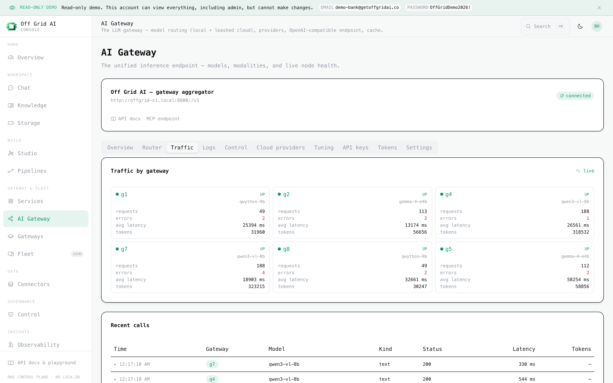

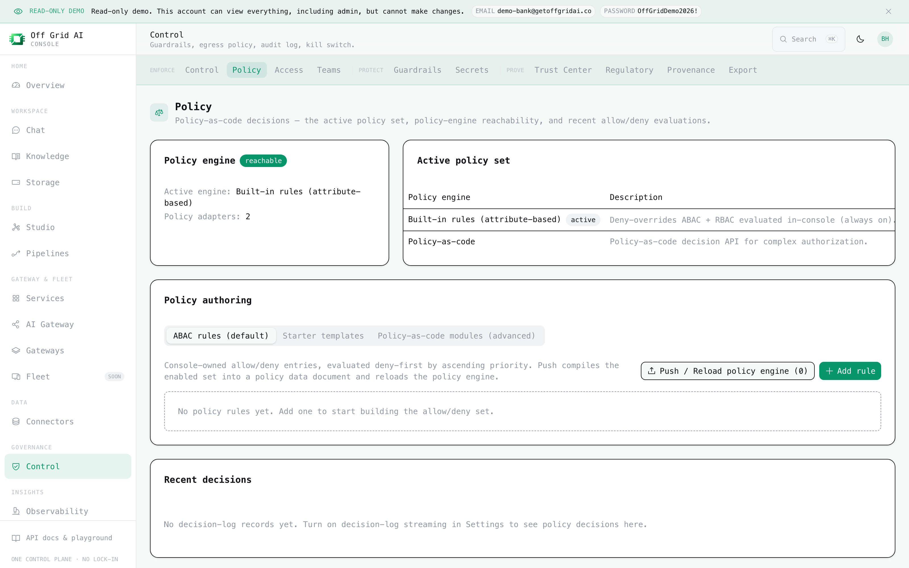

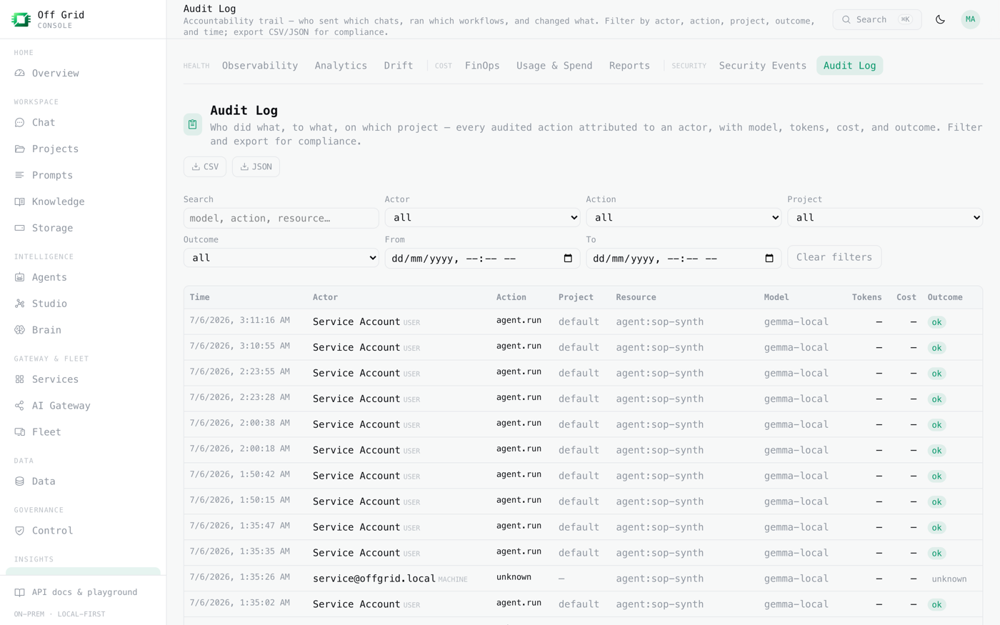

---

## Knowledge — your content, grounded and cited

Agents answer from *your* SOPs and playbooks, not the model's guesses. A versioned knowledge base, a retrieval router that queries the right source, and grounding checks that verify each claim against its sources before it ships — with provenance on every hit.

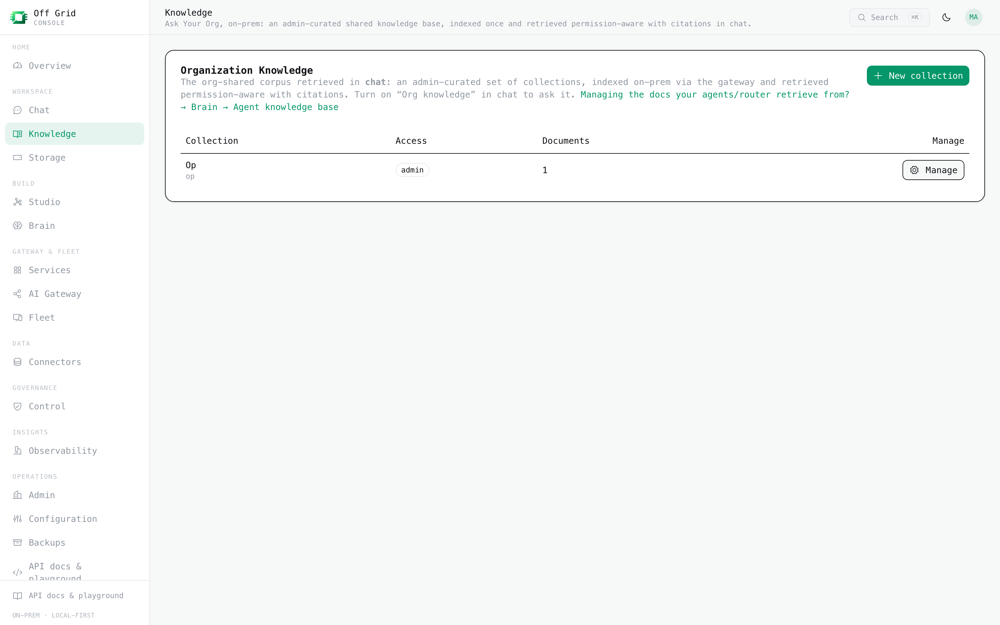

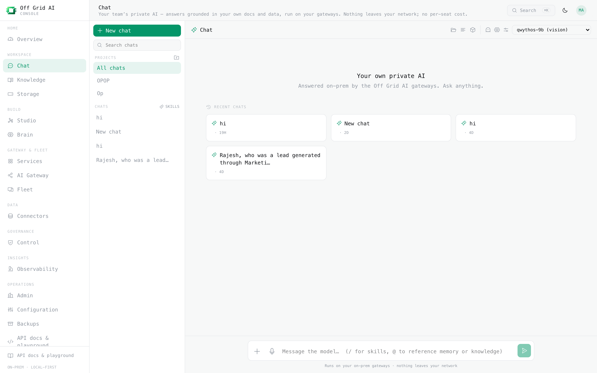

---

## Build — apps and agents in plain language

The Studio is where anyone on the team describes a workflow in plain language and gets a governed app: a five-screen lifecycle (build → input → running → review → reports), human-in-the-loop approvals, and every run bound to a pipeline so it inherits your rules.

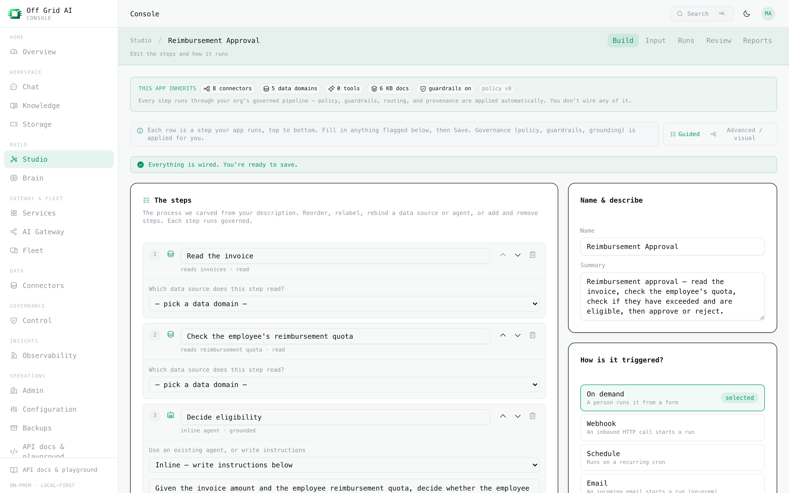

---

## Agent QA — proof the agents still do a good job

Automated QA that answers: are they working, and if not, which one regressed and when? Golden-set evals gate every release; an LLM-as-judge scores live traffic for quality and faithfulness and trends it over time; drift detection catches distribution shift before a customer or regulator does.

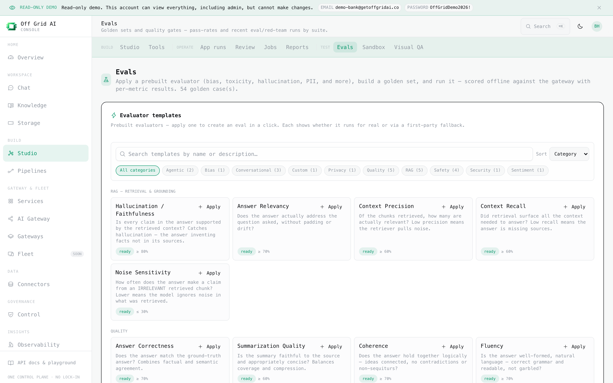

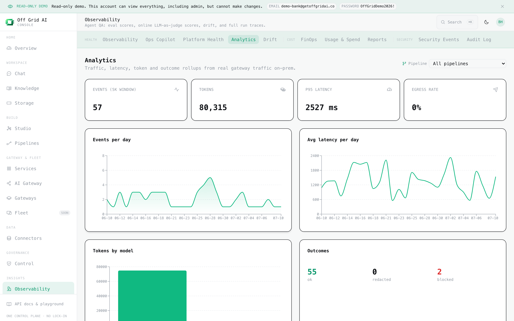

---

## Trust — tamper-evident, provable outputs

Prove what was produced, by whom, unaltered. Every report carries a detached signed manifest, offline-verifiable with only a public key; a queryable source → chunk → answer graph explains where any answer came from.

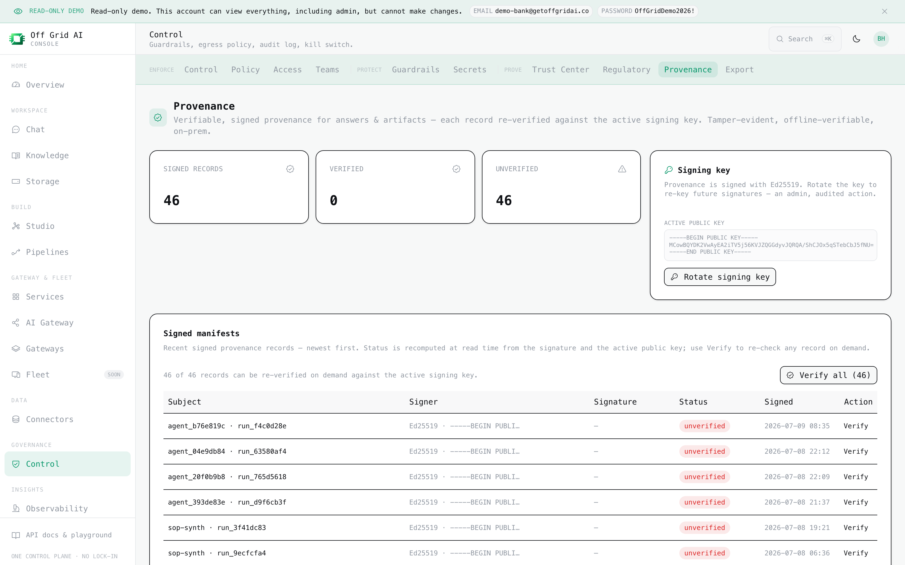

---

## Data — one governed source of truth

Connect enterprise systems, classify and set retention on every asset, and feed pipelines from one catalog — so the same governed data powers every app, agent, and report.

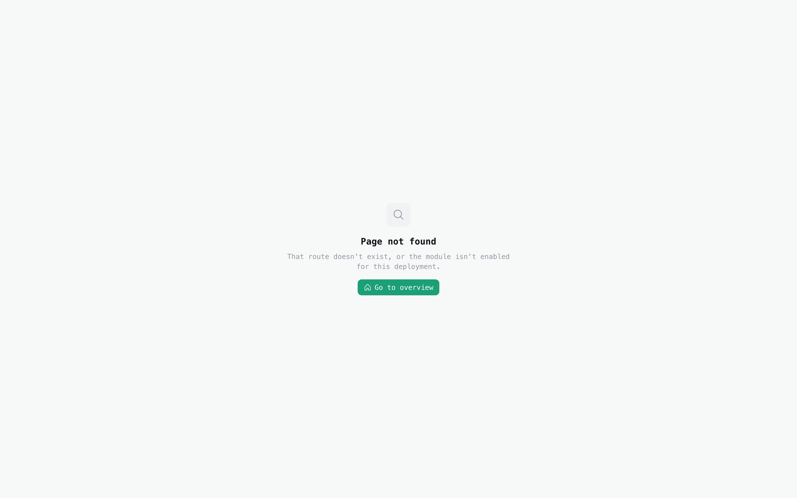

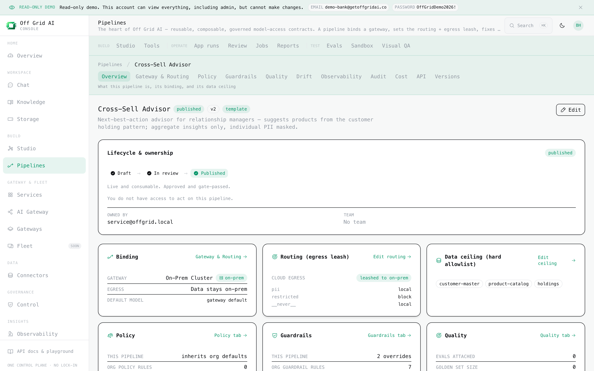

---

## Regulatory — defensible to a regulator and a board

Turn the audit trail into the documents they actually ask for: DPDP / RBI / SEBI / IRDAI-aligned report packs generated from the record, a governance registry that makes model risk a board-level line item, and per-tenant isolation with on-prem residency.

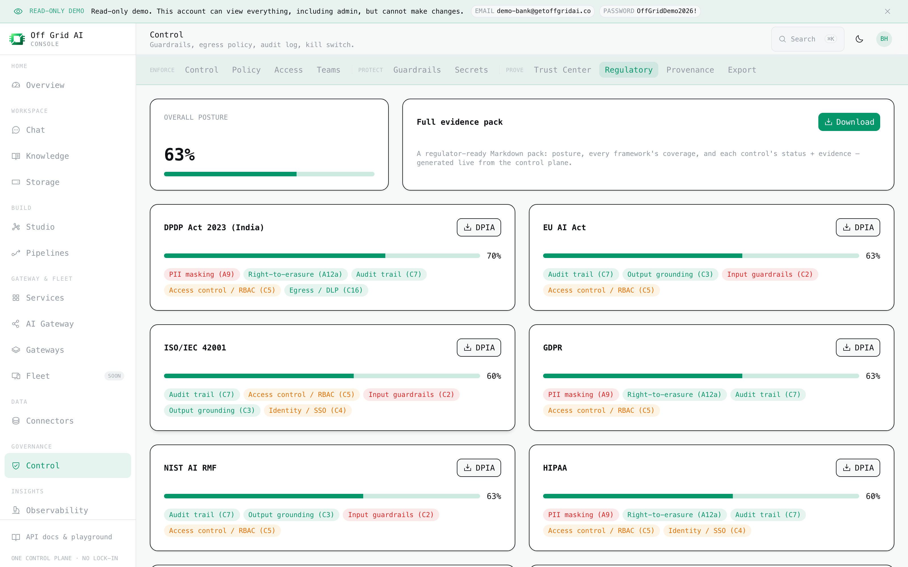

---

## Consumption — one pane of glass, with the money in view

Where people meet the agents and you keep control: issue virtual keys with budgets, see and cap AI spend per person, team, and project, and charge it back — no surprise token bills.

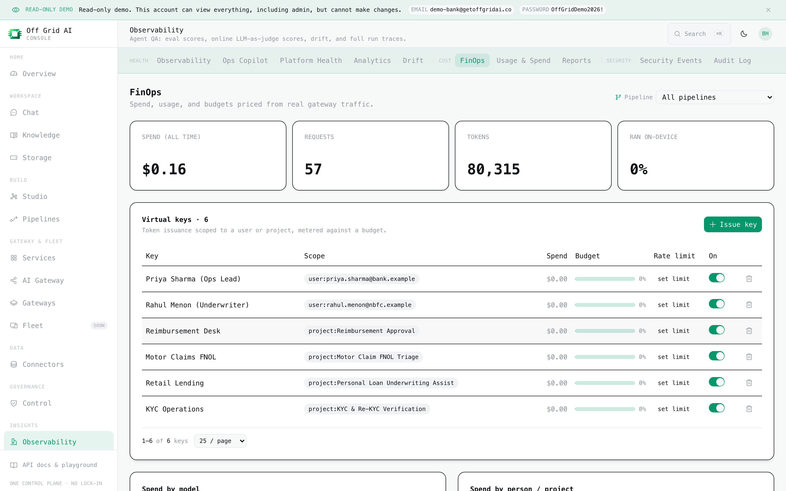

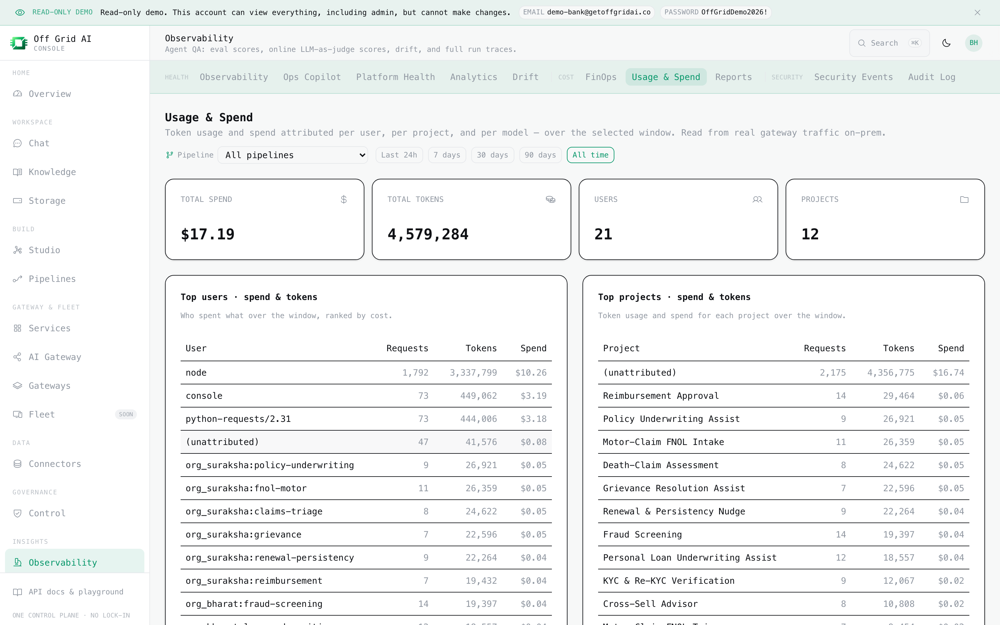

---

  Built on open source. Swap any underlying engine with one environment variable — never locked to a vendor.

